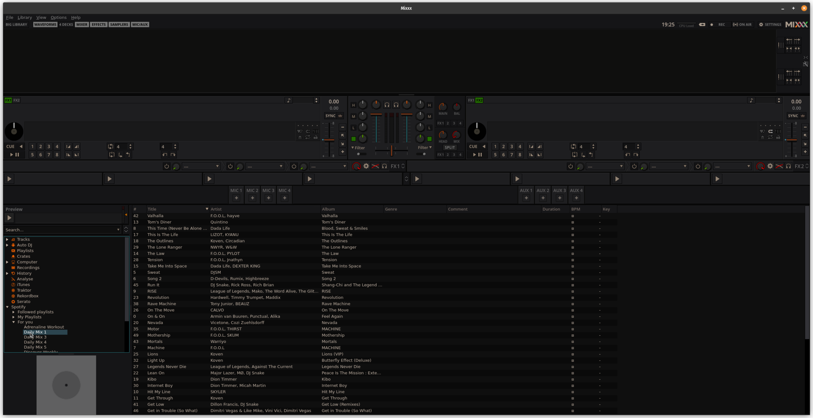
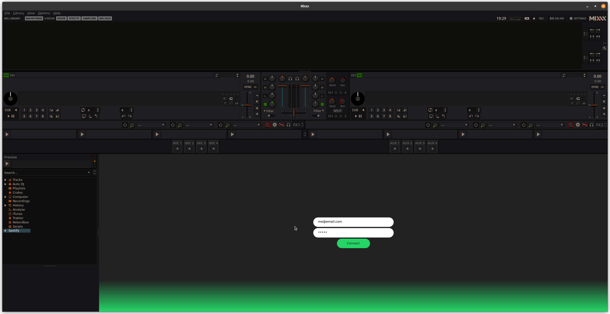
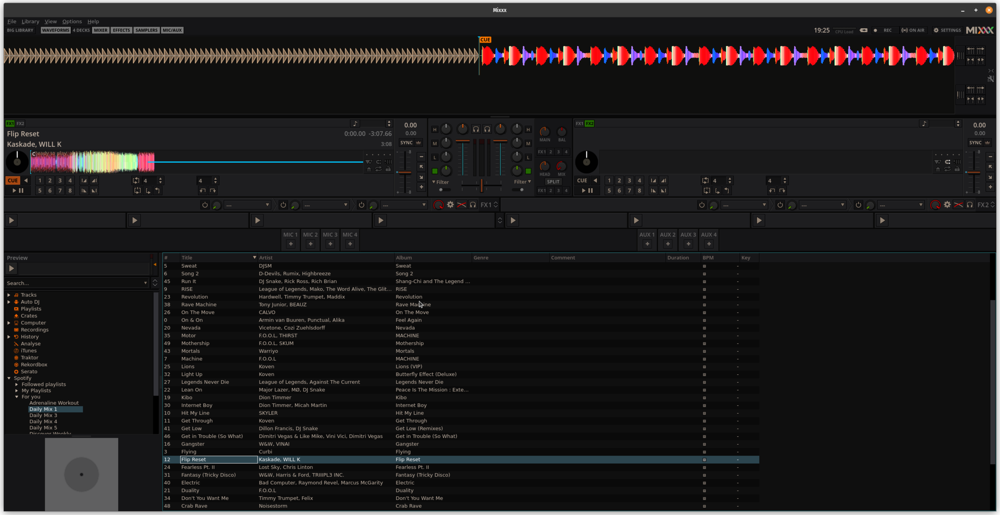

# Mixxx Librespot Plugin

This is a proof of concept related to the proposal on introducing a plugin mechanism in the Mixxx software. Currently, this has only be tested on Linux, but it should also work on Mac.

**DISCLAIMER: This is a proof of concept! A lot of usecase and edgecase have been omitted. It is still containing bugs. Make SURE to backup your Mixxx database or spin up a temporary setting directory**

## Getting started

Before you can compile and run this plugin, you will need to:

- Download the [proto spec](https://github.com/mixxxdj/mixxx/blob/1f0bad0ad9d2f68a42ac1dd57d1509b5c64b88c2/src/proto/plugin.proto) and store it locally as `plugin.proto`
- Build and run with `cargo build`. It is recommended to run with `RUST_LOG=info` or `debug` for later steps
- Build and run the [PoC of Mixxx](https://github.com/acolombier/mixxx/tree/poc/lbrary-module)

> Note: The plugin will create a unix socket in `/tmp` and a local folder called `spotcache` used for file caching. Feel free to adjust it directly in the code (and in Mixxx code for the socket) if you would like to use different location.

Note that the login form  interaction is currently not implemented, so you will need to perform logging using bare gRPC. You can do so using `grpcurl`, it should look like something like this:

```sh
docker run -u 0 -itv /tmp/mixxx_plugin_test:/tmp/grpc -v $PWD:/proto:ro --rm fullstorydev/grpcurl -import-path ../proto -proto plugin.proto -d '{"submit": {"id": "login", "payload": "username=...&password=..."}}' -unix=true -plaintext -vv /tmp/grpc mixxx.plugin.PluginService/Event
```

Once you have logged in successfully (visible in logs, and also usually would see a notification from Spotify by e-mail), you can use the plugin in Mixxx.

> Note: You might want to start Mixxx only after you've done the preparation mentioned above

## Screenshots

*Browsing*


--------
*Playlists*


--------
*Custom views*


--------
*Playlists*


--------
*Search*


--------
*Loading track*
